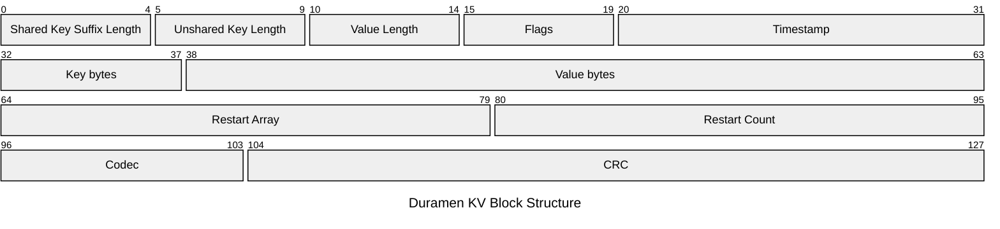

### Description of the storage structure behind Lignum

- Lignum is a database system built on a foundation of a key-value storage engine called `Duramen`.
- It stores facts and related artifacts in a KV store but also offers support for:
- Projections - virtual views of data that can be queried like tables but are not stored physically
    - Aggregates - pre-computed aggregates of data that can be queried like tables but are not stored physically
    - Projections - columnar, graph and vector projections. These projections are used to store data in a way that is optimized for specific types of queries.


- The KV store is built on a foundation of a Log Structured Merge Tree (LSM Tree) with an in-memory `MemTable` for reads & writes and sorted `SSTables` on disk for reads. It also features a `WAL` (Write-Ahead Log) for durability.

### Storage structure:
- **Duramen** - Key-value storage engine
    - **WAL** - Write-Ahead Log for durability
    - **MemTable** - In-memory storage for reads & writes
    - **SSTable** - Sorted String Table on disk for reads
    - **Compaction** - Background process for merging SSTables
    - **Block Manager** - Manages blocks of data in memory
    - **Catalog Manager** - Manages metadata about the database
    - **Index Manager** - Manages indexes for the database
    - **Recovery Manager** - Manages recovery from failures

### Overview of Duramen:
- Duramen is a KV store built on a foundation of a Log Structured Merge Tree (LSM Tree) with an in-memory `MemTable` for reads & writes and sorted `SSTables` on disk for reads. It also features a `WAL` (Write-Ahead Log) for durability.

- It also supports columnar, graph and vector storage formats that result from user-defined or system-defined projections.

#### SSTable Architecture Overview
- This is the core storage format for Duramen. It is a sorted string table that is stored on disk. It is immutable and can be read from, but not written to.

- At the top-most level, an SSTable is a sequence of blocks. These blocks are of fixed size and are stored contiguously on disk.

- Within each SSTable, there are (4KB) data blocks. Each data block stores key-value pairs contiguously. Then section that follows gives an overview of the structure of a data block.


##### Duramen Data Block Structure

- A data block in `Duramen` is a 4Kb fixed-size blocks of bytes that stores key-value pairs contiguously. Its general structure is as follows:

```
Key-Value Pairs | Restart Section | Block Footer |
```
_(Duramen's block does not store any header information)_.

__Entry__
- Key-Value paris are stored as entries. Each block entry contain a fixed size header and a variable size data section. 
- The `Entry Header` is of size 24 bytes and is located at the beginning of the entry. Its structure is as follows:
    - **Shared Key Suffix Length** - A 4-byte number that identifies the length of the shared key suffix.
    - **Unshared Key Length** - A 4-byte number that identifies the length of the unshared key.
    - **Value Length** - A 4-byte number that identifies the length of the value.
    - **Flags** - A 4-byte number that identifies the flags for the entry.
    - **Timestamp** - An 8-byte number that identifies the commit timestamp of the entry.

<div align="center">
<pre>
┌───────────────────────────────────────┬───────────────────────────────────────┐
│       Shared Key Suffix Length        │          Unshared Key Length          │
│               (4 Bytes)               │               (4 Bytes)               │
├───────────────────────────────────────┼───────────────────────────────────────┤
│             Value Length              │                 Flags                 │
│               (4 Bytes)               │               (4 Bytes)               │
├───────────────────────────────────────┴───────────────────────────────────────┤
│                                   Timestamp                                   │
│                                   (8 Bytes)                                   │
└───────────────────────────────────────────────────────────────────────────────┘
</pre>
<p><b>Entry Header Layout</b></p>
</div>

- The `Entry Data` is a variable-size block of bytes that contains the key and value for the entry. It is located after the entry header. Its structure is as follows:
    - **Key bytes** - The length of the key bytes is determined by the `Unshared Key Length` and `Shared Key Suffix Length` fields in the entry header.
    - **Value bytes** - The length of the value bytes is determined by the `Value Length` field in the entry header. However, the structure of the value bytes is slightly more complex. 

<div align="center">
<pre>
┌───────────────────────┬───────────────────────────────────────────────────────┐
│       KEY BYTES       │                      VALUE BYTES                      │
├───────────┬───────────┼───────────────────────────┬───────────────────────────┤
│  Shared   │ Unshared  │       RECORD HEADER       │        RECORD DATA        │
│  Suffix   │    Key    │         (16 Bytes)        │      (Variable Size)      │
│ (Var Size)│ (Var Size)│                           │                           │
└───────────┴───────────┴───────────────────────────┴───────────────────────────┘
</pre>
<p><b>Entry Data Layout</b></p>
</div>


- The `value bytes` is divided into:
    - **Record Header** - A 16-byte header that contains metadata about the value.
    - **Record Data** - The actual value data.

- The structure of `Record Header` is as follow:
    - **Schema ID** - A 4-byte number that identifies the schema of the value.
    - **Schema Version** - A 4-byte number that identifies the version of the schema.
    - **Record Flags** - A 4-byte number that identifies the flags for the record.
    - **Reserved / Padding** - A 4-byte reserved/padding space.

<div align="center">
<pre>
┌───────────────────────────────────────┬───────────────────────────────────────┐
│               Schema ID               │            Schema Version             │
│               (4 Bytes)               │               (4 Bytes)               │
├───────────────────────────────────────┼───────────────────────────────────────┤
│             Record Flags              │          Reserved / Padding           │
│               (4 Bytes)               │               (4 Bytes)               │
└───────────────────────────────────────┴───────────────────────────────────────┘
</pre>
<p><b>Record Header Layout</b></p>
</div>

- The `Record Data` is a variable-size block of bytes that contains the actual value data. Its structure is as follows:
    - **Null Bitmap** - A N-bit number that identifies the null bitmap for the record. Where N is the number of fields in the schema.
    - **Fixed Length Fields Region** - Consecutive bytes for all fixed length fields. Each field takes the size of the field type as defined in the schema.
    - **Variable-Length Offset Table** - A table that contains the offsets of all variable length fields. This table is sorted by the order of the fields in the schema.
    - **External Fixed-Length References** - This comprises of the `object id` and the `object length` for all feilds that are stored externally. Each "pointer" has a length of 16 bytes.
    - **Variable Length Payload Region** - Consecutive bytes for all variable length fields. Each field is stored contiguously in the order of the fields in the schema.

<div align="center">
<pre>
┌───────────────────────────────────────────────────────────────────────────────┐
│                                  Null Bitmap                                  │
│                 ┌───┬───┬───┬───┬───────┬─────┬───────────┐                   │
│                 │ 0 │ 1 │ 2 │ 3 │  ...  │ N-1 │  Padding  │                   │
│                 └───┴───┴───┴───┴───────┴─────┴───────────┘                   │
├───────────────────────────────────────────────────────────────────────────────┤
│                          Fixed-Length Fields Region                           │
│     ┌───────────────────┬───────────────────┬───────────────────────────┐     │
│     │      Field 1      │      Field 2      │      Field 3 (etc...)     │     │
│     └───────────────────┴───────────────────┴───────────────────────────┘     │
├───────────────────────────────────────────────────────────────────────────────┤
│                         Variable-Length Offset Table                          │
│     ┌───────────────────┬───────────────────┬───────────────────────────┐     │
│     │     Offset 1      │     Offset 2      │     Offset 3 (etc...)     │     │
│     └───────────────────┴───────────────────┴───────────────────────────┘     │
├───────────────────────────────────────────────────────────────────────────────┤
│                External Fixed-Length References (Ref Table)                   │
│     ┌───────────────────────────────────────┬───────────────────────────┐     │
│     │         External Object ID            │    Object Length (8B)     │     │
│     │              (8 Bytes)                │                           │     │
│     ├───────────────────────────────────────┴───────────────────────────┤     │
│     │                     ... (Additional Pointers)                     │     │
│     └───────────────────────────────────────────────────────────────────┘     │
├───────────────────────────────────────────────────────────────────────────────┤
│                        Variable Length Payload Region                         │
│     ┌───────────────────────────┬───────────────────────────────────────┐     │
│     │     Var-Len Payload 1     │           Var-Len Payload 2           │     │
│     └───────────────────────────┴───────────────────────────────────────┘     │
└───────────────────────────────────────────────────────────────────────────────┘
</pre>
<p><b>Record Data Layout</b></p>
</div>

__Restart Section__
- The restart section is a variable-length block of bytes that contains metadata about restart points within the block. It's structure is as follows:
    - **Restart Array** - A fixed-size array of offsets to "restart points" within the block. These restart points are evenly distributed throughout the block. Each entry is called a `restart offset` and is a 4-byte number.
    - **Restart Count** - A 2-byte number that identifies the number of restart points in the block.

<div align="center">
<pre>
┌───────────────────────────────────────────────────────────────────────────────┐
│                                 Restart Array                                 │
│                                (Variable Size)                                │
├───────────────────────────────────────────────────────────────────────────────┤
│                                 Restart Count                                 │
│                                   (2 Bytes)                                   │
└───────────────────────────────────────────────────────────────────────────────┘
</pre>
<p><b>Restart Section Layout</b></p>
</div>

__Block Footer__
- The block footer is a 5-byte fixed-size block of bytes that contains metadata about the block. Its structure is as follows:
    - **Codec** - A 1-byte field that identifies the codec used to compress the block.
    - **CRC** - A 4-byte CRC checksum of the block.
- The footer does not undergo compression, and its CRC is calculated over the raw uncompressed data of the block.

<div align="center">
<pre>
┌───────────────────────────────────────────────────────────────────────────────┐
│                                  Block Footer                                 │
│                            (Fixed Size - 5 Bytes)                             │
├───────────────────────────────────────┬───────────────────────────────────────┤
│                Codec                  │                  CRC                  │
│               (1 Byte)                │               (4 Bytes)               │
└───────────────────────────────────────┴───────────────────────────────────────┘
</pre>
<p><b>Block Footer Layout</b></p>
</div>

#### General Block Structure of the Duramen Storage Engine

- The structure of the KV block of Duramen is as follows (not drawn to scale):





#### General SSTable Structure of the Duramen Storage Engine

- Duramen's SSTable consists of the following parts:
    - **A set of Data Entries** - A Data Entry is a fixed-size block of bytes that contains key-value pairs.
    - **Index Block** - An index block is a variable-length block of bytes that contains offsets to the start of each data block.
    - **Filter Block** - A filter block is a variable-length block of bytes that contains Bloom filters for each data block.
    - **Metaindex Block** - A metaindex block is a variable-length block of bytes that contains offsets to the start of each index block.
    - **SSTable Footer** - The footer is a fixed-size block of bytes and is as follows:
        - **Metaindex BlockHandle** - A handle to the metaindex block.
        - **Index BlockHandle** - A handle to the index block.
        - **Format Version** - The format version of the SSTable which allows for the future evolution of the SSTable format.
        - **Magic Number** - identifies the file as a `Duramen` SSTable.

- The structure of the `BlockHandle` is as follows:
    - **Offset** - The offset of the block.
    - **Length** - The length of the block.


__Index Block__
- The index block is a variable-length block of bytes that contains offsets to the start of each data block.
- It comprises of the following:
    - **Index Entries** - A list of index entries. Each entry has the following structure:
        - **Separator Key** - The separator key between two data blocks.
        - **Block Handle** - The handle to the data block.
            - **Offset** - The offset of the block.
            - **Length** - The length of the block.

<div align="center">
<pre>
┌───────────────────────────────────────────────────────────────────────────────┐
│                                  INDEX ENTRY                                  │
├───────────────────────────────────────┬───────────────────────────────────────┤
│             Separator Key             │             Block Handle              │
├───────────────────────────────────────┼───────────────────┬───────────────────┤
│          Key Bytes / Suffix           │    Block Offset   │   Block Length    │
│            (Variable Size)            │ (Variable/Varint) │ (Variable/Varint) │
└───────────────────────────────────────┴───────────────────┴───────────────────┘
</pre>
<p><b>Index Entry Layout</b></p>
</div>

- **Restart Array** - An array of offsets to "restart points" within the block. These restart points are evenly distributed throughout the block. Each entry is called a `restart offset` and is a 4-byte number.
- **Restart Count** - A 2-byte number that identifies the number of restart points in the block.
- **Codec** - A 1-byte field that identifies the codec used to compress the block.
- **CRC** - A 4-byte CRC checksum of the block.

<div align="center">
<pre>
┌───────────────────────────────────────────────────────────────────────────────┐
│                                  INDEX BLOCK                                  │
├───────────────────────────────────────────────────────────────────────────────┤
│                                 Index Entries                                 │
│          ┌───────────────────┬───────────────────┬───────────────────┐        │
│          │      Entry 1      │      Entry 2      │      Entry ...    │        │
│          └───────────────────┴───────────────────┴───────────────────┘        │
├───────────────────────────────────────────────────────────────────────────────┤
│                                Restart Section                                │
│          ┌───────────────────────────────────────────────────────────┐        │
│          │                       Restart Array                       │        │
│          │                      (Variable Size)                      │        │
│          ├───────────────────────────────────────────────────────────┤        │
│          │                       Restart Count                       │        │
│          │                         (2 Bytes)                         │        │
│          └───────────────────────────────────────────────────────────┘        │
├───────────────────────────────────────────────────────────────────────────────┤
│                                 Block Footer                                  │
│          ┌─────────────────────────────┬─────────────────────────────┐        │
│          │            Codec            │             CRC             │        │
│          │          (1 Byte)           │          (4 Bytes)          │        │
│          └─────────────────────────────┴─────────────────────────────┘        │
└───────────────────────────────────────────────────────────────────────────────┘
</pre>
<p><b>Index Block Layout</b></p>
</div>

_(The metaindex block bears the name of the structure)_.


__Filter Block__

- Stores block filter data instead of ordered keys; no `restart points`.
- It is structured as follows:
    - **Bloom Filters** - Bloom filters for each data block.
    - **Filter Offsets** - Offsets to the start of each Bloom filter.
    - **Filter Count** - The number of Bloom filters in the block.
    - **Codec** - The codec used to compress the block.
    - **CRC** - A CRC checksum of the block.

<div align="center">
<pre>
┌───────────────────────────────────────────────────────────────────────────────┐
│                                 FILTER BLOCK                                  │
├───────────────────────────────────────────────────────────────────────────────┤
│                                 Bloom Filters                                 │
│          ┌───────────────────┬───────────────────┬───────────────────┐        │
│          │     Filter 1      │     Filter 2      │     Filter ...    │        │
│          │  (Variable Size)  │  (Variable Size)  │  (Variable Size)  │        │
│          └───────────────────┴───────────────────┴───────────────────┘        │
├───────────────────────────────────────────────────────────────────────────────┤
│                                Filter Offsets                                 │
│          ┌───────────────────┬───────────────────┬───────────────────┐        │
│          │     Offset 1      │     Offset 2      │     Offset ...    │        │
│          │     (4 Bytes)     │     (4 Bytes)     │     (4 Bytes)     │        │
│          └───────────────────┴───────────────────┴───────────────────┘        │
├───────────────────────────────────────────────────────────────────────────────┤
│                                 Filter Count                                  │
│                                  (4 Bytes)                                    │
├───────────────────────────────────────────────────────────────────────────────┤
│                                 Block Footer                                  │
│          ┌─────────────────────────────┬─────────────────────────────┐        │
│          │            Codec            │             CRC             │        │
│          │          (1 Byte)           │          (4 Bytes)          │        │
│          └─────────────────────────────┴─────────────────────────────┘        │
└───────────────────────────────────────────────────────────────────────────────┘
</pre>
<p><b>Filter Block Layout</b></p>
</div>


In a general sense, `Duramen's` SSTable structure looks as follows:

<div align="center">
<pre>
┌───────────────────────────────────────────────────────────────────────────────┐
│                               Duramen SSTable                                 │
├───────────────────────────────────────────────────────────────────────────────┤
│                                 Data Block 1                                  │
│                  (Key-Value Pairs + Restart Offset Table)                     │
├───────────────────────────────────────────────────────────────────────────────┤
│                                 Data Block 2                                  │
├───────────────────────────────────────────────────────────────────────────────┤
│                                      ...                                      │
├───────────────────────────────────────────────────────────────────────────────┤
│                                 Data Block N                                  │
├───────────────────────────────────────────────────────────────────────────────┤
│                                 Filter Block                                  │
│                 (Bloom Filters for data block key presence)                   │
├───────────────────────────────────────────────────────────────────────────────┤
│                               Metaindex Block                                 │
│              (Index of Filter Block; maps names to handles)                   │
├───────────────────────────────────────────────────────────────────────────────┤
│                                 Index Block                                   │
│           (Index of Data Blocks; maps separator keys to handles)              │
├───────────────────────────────────────────────────────────────────────────────┤
│                                SSTable Footer                                 │
│          ┌───────────────────────────────────────────────────────────┐        │
│          │               Metaindex BlockHandle (Offset/Len)          │        │
│          ├───────────────────────────────────────────────────────────┤        │
│          │                 Index BlockHandle (Offset/Len)            │        │
│          ├───────────────────────────────────────────────────────────┤        │
│          │                       Format Version                      │        │
│          ├───────────────────────────────────────────────────────────┤        │
│          │                 Magic Number (Duramen SST)                │        │
│          └───────────────────────────────────────────────────────────┘        │
└───────────────────────────────────────────────────────────────────────────────┘
</pre>
<p><b>SSTable File Layout</b></p>
</div>